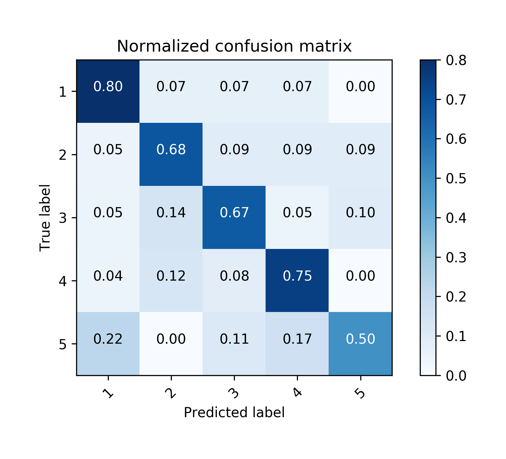
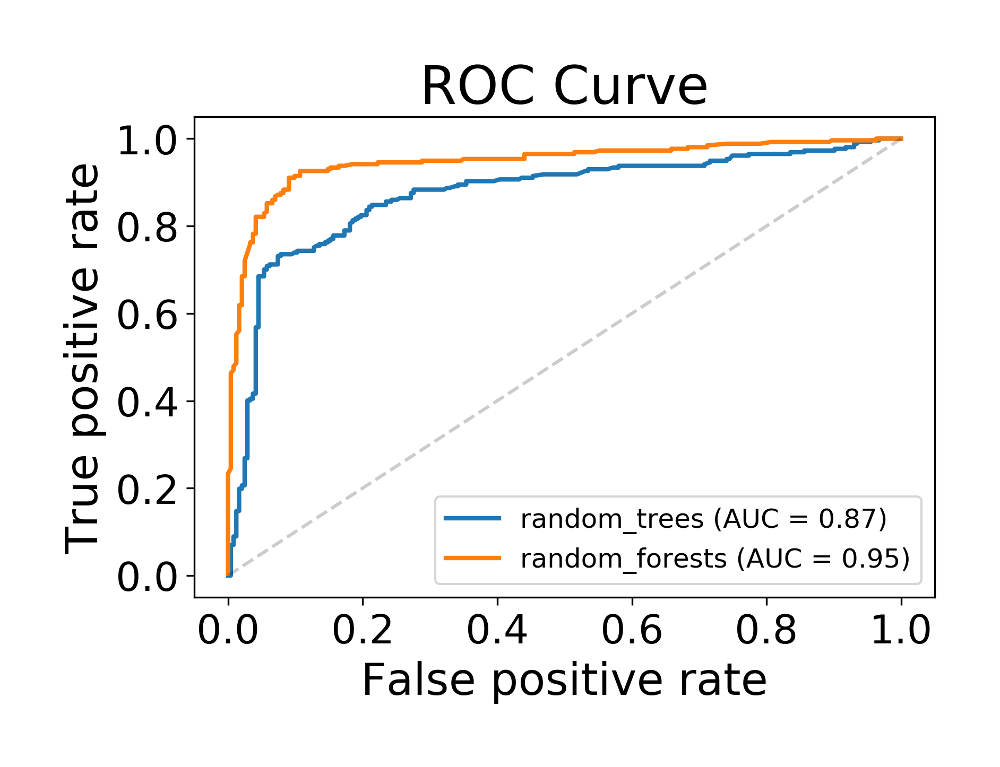

# Data Visualization
Here are some common methods for data visualization, mainly focus on displaying the results of machine learning and deep learning.

## [Confusion Matrix](confusion_matrix.py)
The **confusion matrix** is used to evaluate the quality of the output of a classification task. The daigonal elements represent the number of points for which the predicted label is equal to the true label, while off-diagonal elements are those that are mislabeled by the classifier. The higher the diagonal values of the confusion matrix the better, indicating many correct predictions.

The figures show the confusion matrix with and without normalization by class support size (number of elements in each class). This kind of normalization can be interesting in case of class imbalance to have a more visual interpretation of which class is being misclassified.

### Display
* Confusion matrix without normalization


* Confusion matrix with normalization


### Sample
Sample code for the display images. The referenced python code based on **scikit-learn** can be found [here](http://scikit-learn.org/stable/auto_examples/model_selection/plot_confusion_matrix.html).

```python
from confusion_matrix import draw_confmat

mean = [0, 0]
cov = [[1, 0], [0, 100]]
r1 = np.random.randint(0, 5, size=[40, 2])
r2 = np.random.randint(0, 5, size=[60, 1])
pred = np.concatenate((r1[:, 0], r2[:, 0]), axis=0)
label = np.concatenate((r1[:, 1], r2[:, 0]), axis=0)
d = draw_confmat(5)
d.load_from_list(pred, label)
d.draw(np.array(d.PofT, dtype=np.int), ['1','2','3','4','5'], 'cm.png',
       title='Confusion matrix, without normalization')
d.draw(d.calculate_acc_nxn(), ['1','2','3','4','5'], 'cm_norm.png',
       title='Normalized confusion matrix')
```

## [ROC Curve](roc.py)
In statistic, the [ROC Curve](https://en.wikipedia.org/wiki/Receiver_operating_characteristic) is a graphical plot that illustrates the diagnostic ability of a binary classifier system as its discrimination threshold is varied.

The ROC curve is created by plotting the true positive rate (TPR) against the false positive rate (FPR) at various threshold settings. The true-positive rate is also known as sensitivity, recall or probability of detection in machine learning. The false-positive rate is also known as the fall-out or probability of false alarm and can be calculated as (1 − specificity). The ROC curve is thus the sensitivity as a function of fall-out. In general, if the probability distributions for both detection and false alarm are known, the ROC curve can be generated by plotting the cumulative distribution function (area under the probability distribution from − ∞ to the discrimination threshold) of the detection probability in the y-axis versus the cumulative distribution function of the false-alarm probability on the x-axis.

### Display
* ROC Curve for random trees and random forests on sklearn.datasets


### Sample
Sample code for the display images. The referenced python code based on **scikit-learn** can be found [here](http://scikit-learn.org/stable/auto_examples/ensemble/plot_feature_.html#sphx-glr-auto-examples-ensemble-plot-feature-transformation-py).

```python
from sklearn.datasets import make_classification
from sklearn.linear_model import LogisticRegression
from sklearn.ensemble import RandomTreesEmbedding, RandomForestClassifier
from sklearn.preprocessing import OneHotEncoder
from sklearn.model_selection import train_test_split
from sklearn.pipeline import make_pipeline

n_estimator = 10
X, y = make_classification(n_samples=1000)
X_train, X_test, y_train, y_test = train_test_split(X, y, test_size=0.5)
X_train, X_train_lr, y_train, y_train_lr = train_test_split(X_train, y_train, test_size=0.5)

# Unsupervised transformation based on totally random trees
rt = RandomTreesEmbedding(max_depth=3, n_estimators=n_estimator, random_state=0)
rt_lm = LogisticRegression()
pipeline = make_pipeline(rt, rt_lm)
pipeline.fit(X_train, y_train)
y_pred_rt = pipeline.predict_proba(X_test)[:, 1]

# Supervised transformation based on random forests
rf = RandomForestClassifier(max_depth=3, n_estimators=n_estimator)
rf_enc = OneHotEncoder()
rf_lm = LogisticRegression()
rf.fit(X_train, y_train)
rf_enc.fit(rf.apply(X_train))
rf_lm.fit(rf_enc.transform(rf.apply(X_train_lr)), y_train_lr)
y_pred_rf_lm = rf_lm.predict_proba(rf_enc.transform(rf.apply(X_test)))[:, 1]

draw_roc(fig_path='roc.png',
         random_trees={'pred':y_pred_rt, 'label':y_test},
         random_forests={'pred':y_pred_rf_lm, 'label':y_test})
```