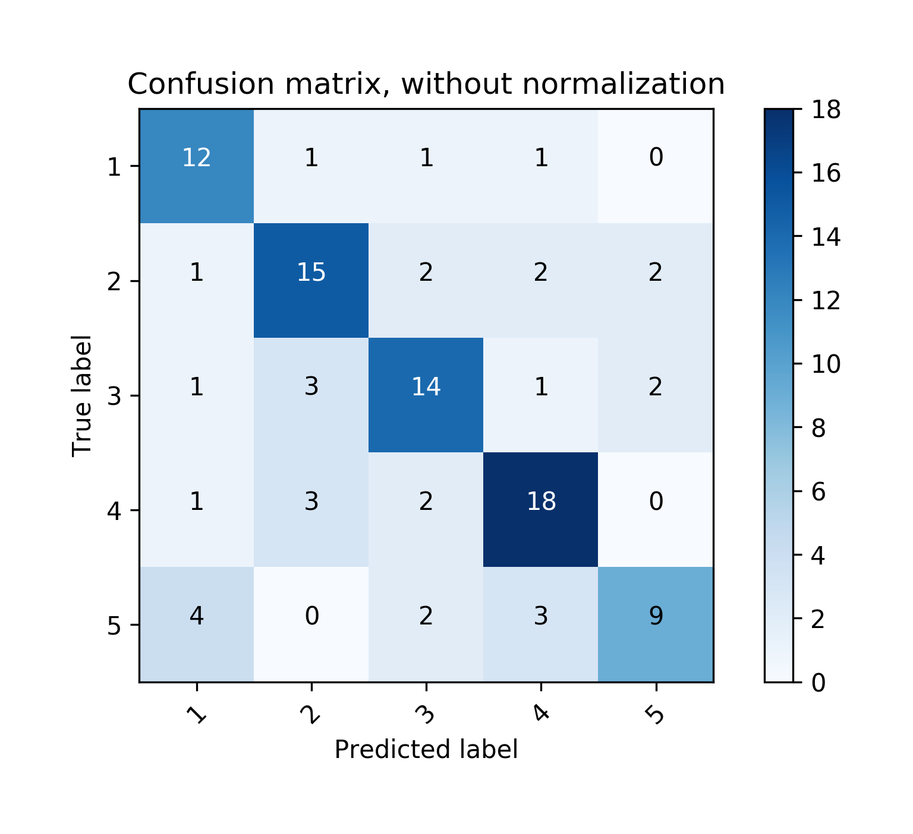

# Data Visualization
Here are some common methods for data visualization, mainly focus on displaying the results of machine learning and deep learning.

## [Confusion Matrix](confusion_matrix.py)
The **confusion matrix** is used to evaluate the quality of the output of a classification task. The daigonal elements represent the number of points for which the predicted label is equal to the true label, while off-diagonal elements are those that are mislabeled by the classifier. The higher the diagonal values of the confusion matrix the better, indicating many correct predictions.

The figures show the confusion matrix with and without normalization by class support size (number of elements in each class). This kind of normalization can be interesting in case of class imbalance to have a more visual interpretation of which class is being misclassified.

### Display
* Confusion matrix without normalization


* Confusion matrix with normalization


### Sample
Sample code for the display images. The referenced python code based on **scikit-learn** can be found [here](http://scikit-learn.org/stable/auto_examples/model_selection/plot_confusion_matrix.html).

```python
from confusion_matrix import draw_confmat

mean = [0, 0]
cov = [[1, 0], [0, 100]]
r1 = np.random.randint(0, 5, size=[40, 2])
r2 = np.random.randint(0, 5, size=[60, 1])
pred = np.concatenate((r1[:, 0], r2[:, 0]), axis=0)
label = np.concatenate((r1[:, 1], r2[:, 0]), axis=0)
d = draw_confmat(5)
d.load_from_list(pred, label)
d.draw(np.array(d.PofT, dtype=np.int), ['1','2','3','4','5'], 'cm.png', \
       title='Confusion matrix, without normalization')
d.draw(d.calculate_acc_nxn(), ['1','2','3','4','5'], 'cm_norm.png', \
       title='Normalized confusion matrix')
```